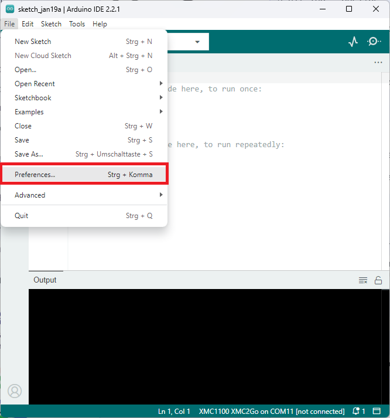
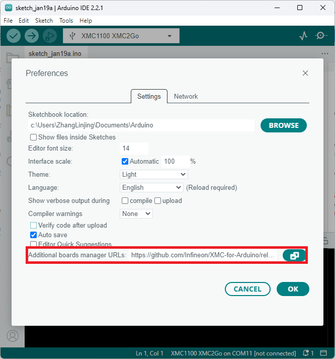

# Infineon's PSoC Microcontroller Boards for Arduino

This repository integrates [Infineon's](https://www.infineon.com/) PSoC microcontrollers into the [Arduino IDE](https://www.arduino.cc/en/main/software).

## Contents

- [Infineon's PSoC Microcontroller Boards for Arduino](#infineons-psoc-microcontroller-boards-for-arduino)
  - [Contents](#contents)
  - [Supported Microcontroller Boards](#supported-microcontroller-boards)
  - [Additional Information](#additional-information)
  - [Installation Instructions](#installation-instructions)
    - [Prework for SEGGER J-Link](#prework-for-segger-j-link)
    - [Required Tools](#required-tools)
    - [Integration of Arduino IDE](#integration-of-arduino-ide)
  - [Contributing](#contributing)

## Supported Microcontroller Boards

* [CY8CKIT-062S2-AI](https://www.infineon.com/cms/en/product/evaluation-boards/cy8ckit-062s2-ai/)

## Additional Information

Please visit Infineon's [PSoC Products Page](https://www.infineon.com/cms/en/product/microcontroller/32-bit-arm-cortex-microcontroller/psoc-6/) for datasheets, pin out diagrams, and additional technical information.

## Installation Instructions

### Prework for SEGGER J-Link

In order to use Infineon's PSoC microcontroller boards in Arduino, you need [SEGGER J-Link](https://www.segger.com/downloads/jlink) installed on your machine first. Please follow [this link](https://www.segger.com/downloads/jlink) and install the J-Link Software and Documentation Pack for your respective operating system (OS).


If you are downloading J-Link for the first time, make sure to check this box: Install USB Driver for J-Link.


### Required Tools

The PSoC-for-Arduino repository requires Python 3.x and `pyserial`. Make sure Python is installed on your machine and available in the system path.

You can check if it was successfully installed by opening your command line or terminal and typing:

```
python --version
```

With [pip](https://pip.pypa.io/en/stable/installation/) available, install the required packages from a terminal:

```
pip install pyserial
```

### Integration of Arduino IDE

Please first download the Arduino IDE. This package is only tested for Arduino IDE >=1.5. We recommend using Arduino IDE >=2.0.



Paste the following URL into the 'Additional boards manager URLs' input field under **File** > **Preferences** to add Infineon's PSoC microcontroller boards to the Arduino IDE.

```
https://github.com/Infineon/PSoC-for-Arduino/releases/latest/download/package_infineon_index.json
```



To install the boards, please go to **Tools** > **Board** > **Boards Manager...** and search for PSoC. You will see options to install the board files for the microcontrollers. Click "Install" to add the boards to your Arduino IDE.


In the boards list **Tools** > **Board**, you will now find the supported PSoC microcontroller boards. 


## Contributing

We welcome contributions to the Arduino PSoC project!

> We would like to have this repository in a polite and friendly atmosphere, so please be kind and respectful to others.
