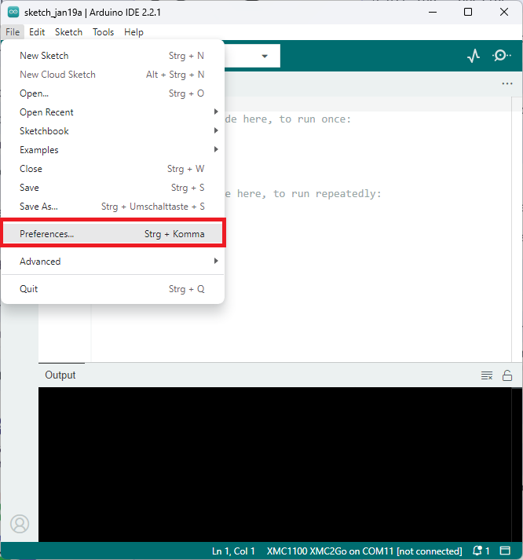
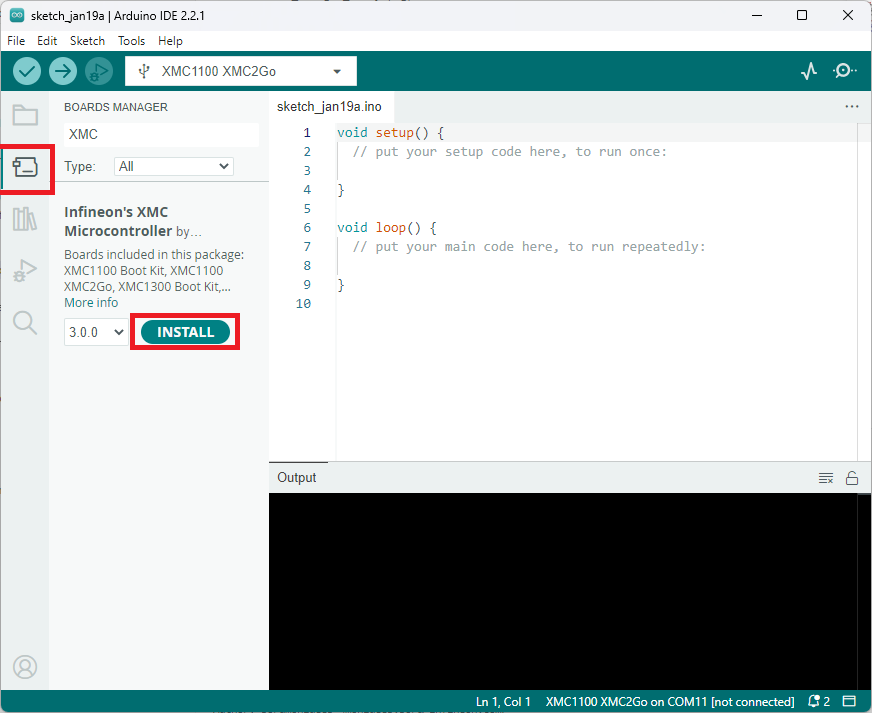
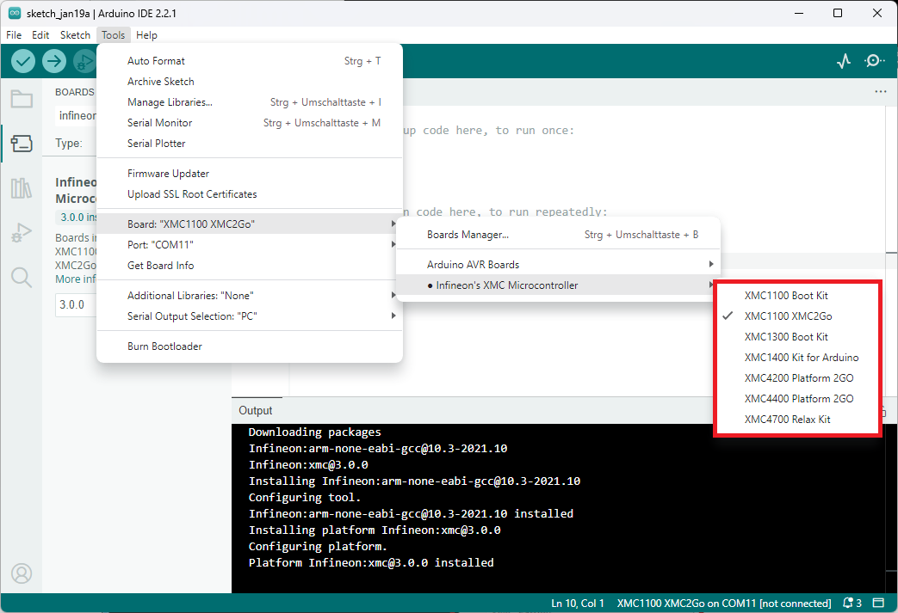

.. _psoc_core_installation:

Installation Instructions
===========================

Required Tools
--------------
...

Integration in Arduino IDE
--------------------------
.. note::
    We recommended to use Arduino IDE 2.0 or higher.

Paste the following URL into the *Additional boards manager URLs* input field under *File > Preferences* to add Infineon's PSoC™ microcontroller boards to the Arduino IDE:

::

    https://github.com/Infineon/arduino-core-psoc/releases/latest/download/package_infineon_index.json

.. image:: img/install_preferences_json.png
    :width: 600

To install the boards, navigate to *Tools > Board > Boards Manager...* and search for *PSoC*. You will see options to install the board files for the microcontrollers. 
Click *Install* to add the boards to your Arduino IDE.

In the boards list *Tools > Board*, you will now find the supported PSoC™ microcontroller boards.

Installation in Arduino CLI
----------------------------

To install the PSoC™ microcontroller boards using the Arduino CLI, first make sure you have the latest version of the Arduino CLI installed. 
Then, run the following command:

.. code-block:: bash

   $ arduino-cli version